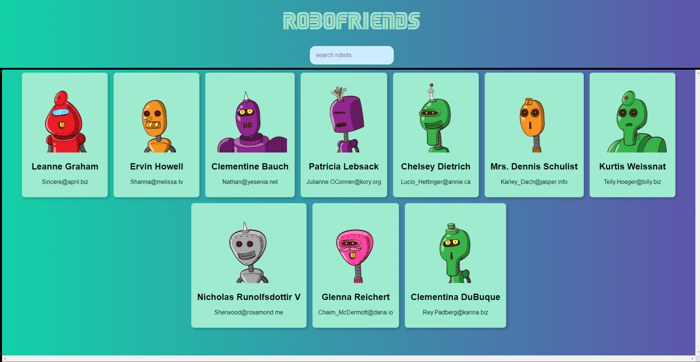
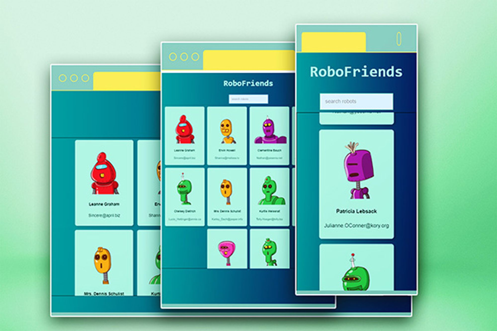

### Instructions To run this project :

1. Clone this repo
2. Change your directory : `cd robo-friends`
3. Run `npm install`
4. Run `npm start`
5. open [http://localhost:3000](http://localhost:3000/) to view it in the browser.

### Key Features

**1. User-Friendly Interface:**

- The search and title components are thoughtfully designed to remain visible on the screen, ensuring a seamless user experience across various device sizes.
    
   
    

**2. Dynamic Card Display:**

- The app intelligently adjusts the number of displayed cards based on the screen width, providing optimal content visibility.

**3. Dynamically Search for Robo Friends:**

- Users can easily search for their robot companions, enhancing the interactive experience and making it effortless to find specific robo friends.
- 
    
    
    

**4. Fast Rendering:**

- The application ensures swift rendering, allowing users to access information and enjoy a responsive interface without delays.

**5. Lightweight Design:**

- With a focus on efficiency, the design is kept lightweight, ensuring a quick and smooth user interaction while minimizing resource consumption.
    
   
    

## Technology Used :

- [ReactJS](https://reactjs.org/) : - React makes it painless to create interactive UIs. Design simple views for each state in application, and React will efficiently update and render just the right components when data changes.
- [Tachyons](https://tachyons.io/) :- Tachyons css toolkit used for styling the components.
- [RoboHash](https://robohash.org/) :- Robohash is a easy web service that makes it easy to provide unique, robot/alien/monster/ whatever images for any text. Put in any text, such as IP address, email, filename, userid, or whatever else we like, and get back a pretty image for site.
- JSON PlaceholderAPI: The application connects to a mock API from [JSON Placeholder](http://jsonplaceholder.typicode.com/) through a Fetch statement, allowing for real-time data interaction.

## Project Overview

RoboFriends is a ReactJS responsive single page web application,  where the user can search for robot friends among all. It allow users to filter the Robots results data via the search form.

- **Tech Foundation:**
Developed starting from the **`create-react-app`** package, the codebase is crafted in JavaScript/JSX, making it accessible and easy to understand for developers of all levels.
- **API Integration:**
The application connects to a mock API from [JSON Placeholder](http://jsonplaceholder.typicode.com/) through a Fetch statement, allowing for real-time data interaction.
- **Stylish CSS with Tachyons:**
Styling is implemented using the Tachyons NPM module, known for its simplicity and efficiency in applying styles using custom abbreviated CSS classes.
- **Personality with RoboHash:** [RoboHash](https://robohash.org/) injects personality into the robot friends by generating unique and visually appealing robot avatars.

### Deployed Version (Feel free to visit) 👇

https://janyamehta.github.io/Robofriends/

